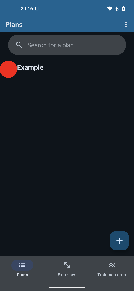
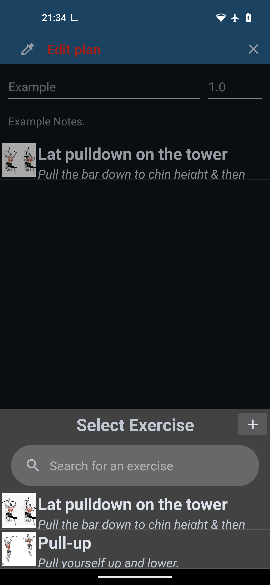
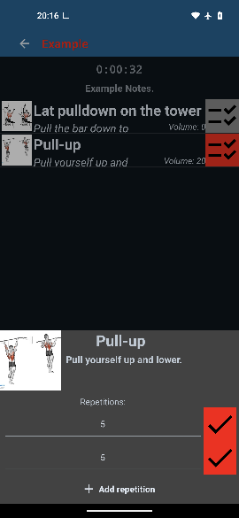
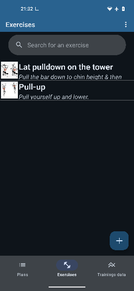
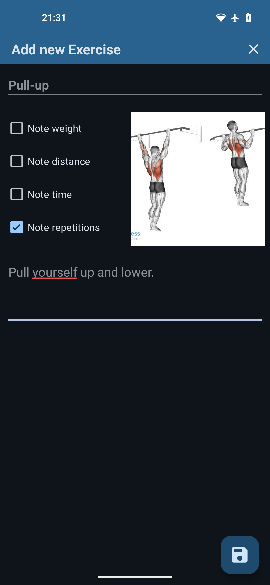
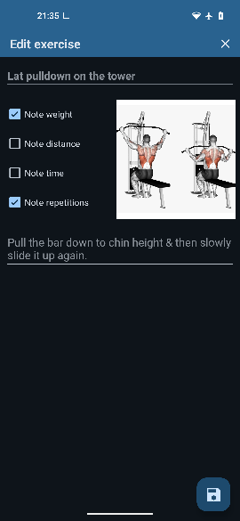
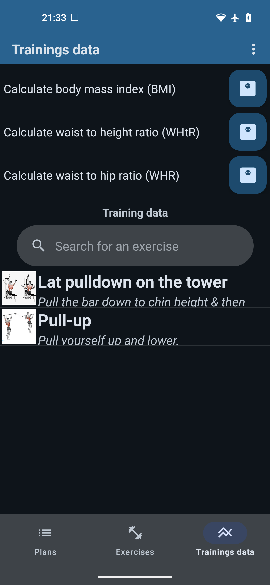

# Fit-Track

  

## Overview
- [Purpose & Benefits](#purpose--benefits)  
- [Features](#features)  
- [Installation](#installation)  
- [Legal & Privacy](#legal--privacy)  
  - *[Legal & Transparency Statement](#legal--transparency-statement)*  
  - *[Third-Party Libraries](#third-party-libraries)*  
  - *[Third-Party Sounds](#third-party-sounds)*  
  - *[Third-Party Assets](#third-party-assets)*  
  - *[Data Usage Notice](#data-usage-notice)*  
  - *[Security Notice](#security-notice)*  
  - *[Disclaimer](#disclaimer)*  
- [Screenshots](#screenshots)

---

## Introduction
**Fit-Track** is a lightweight fitness tracker built to help you log and manage your workout data with ease. It lets you organize exercises, monitor progress, and visualize performance trends — all while keeping your data fully **private and stored locally** on your device.  

> Note: Fit-Track is designed as a tracking tool. It helps you record and analyze workouts, but it doesn’t guarantee any specific fitness or health improvements.

---

## Features

### 🏋️ Create & Manage Workout Plans
- Add and edit exercises or full workout plans directly in the app.  
- Attach images to exercises and color-code your plans for quick identification.  
- Write notes for each plan or exercise — shown automatically during training.

### ⏱️ Training Mode
- Mark off completed repetitions as you go.  
- Enable optional reminders for upcoming sets.  
- Exercises are automatically marked complete once finished.

### 📈 Progress Tracking
- Automatically saves key metrics like average weight and training volume.  
- Compare your new results with previous sessions to track progress over time.

### 🧮 Built-in Calculators
- Includes handy tools like a **BMI calculator** and more within the data section.

### ✨ Additional Highlights
- Modern **Material You** design  
- Auto-save for all entries  
- Search functionality for exercises and plans  
- Sound alerts for reminders  
- Swipe-to-delete gestures  
- English and German language support  
- Light and dark themes  
- Data import/export options  
- Update notifications  

---

## Installation
**Requirements:** Android 7.0 or higher  

### 📦 Install via F-Droid *(currently unavailable)*
1. Install [F-Droid](https://f-droid.org/) on your Android device.  
2. Search for **Fit-Track**.  
3. Tap **Install** to download the app.

### 📱 Install via APK
1. Visit [F-Droid.org](https://f-droid.org/).  
2. Search for **Fit-Track**.  
3. Choose your preferred app version.  
4. Click **Download APK**.  
5. Locate the downloaded `.apk` file in your file manager.  
6. Tap the file and follow the on-screen installation steps.

---

## Legal & Privacy

### Legal & Transparency Statement
This document provides transparency about Fit-Track’s data handling and use of open-source components.  
The app follows the principles of the **Apache License 2.0** and general privacy best practices.  
If distributed through an app store, this README serves as an official reference for users.

---

### Third-Party Libraries
Fit-Track makes use of the following open-source libraries:

- [AmbilWarna](https://github.com/yukuku/ambilwarna) — by yukuku  |  [Apache 2.0 License](https://www.apache.org/licenses/LICENSE-2.0)  
- [MPAndroidChart](https://github.com/PhilJay/MPAndroidChart) — by PhilJay  |  [Apache 2.0 License](https://www.apache.org/licenses/LICENSE-2.0)  
- [Picasso](https://github.com/square/picasso) — by Square  |  [Apache 2.0 License](https://www.apache.org/licenses/LICENSE-2.0)  

Standard AndroidX and Google libraries are also used via the Android SDK.

---

### Third-Party Sounds
Fit-Track uses freely available sound effects from [Pixabay](https://pixabay.com/) created by the following authors:

- Universfield — *notification beep*, *notification #4*, *error call to attention*  
- supremetylewiss — *message*  
- Lesiakower — *Confirm / Notification / Pop-up Effect*  
- BenKirb — *Notification Sound 3*  
- Tuomas_Data — *New Message 31*

---

### Third-Party Assets
Icons are sourced from the [Material Icons Library](https://fonts.google.com/icons) by Google and are licensed under the [Apache License 2.0](https://www.apache.org/licenses/LICENSE-2.0).  
© Google — Licensed under the Apache License, Version 2.0.

---

### Data Usage Notice
Fit-Track stores all workout and training data **locally** on your device.  
It does **not** collect, transmit, or store any personal identifiers (like name, email, or location).  
All data remains anonymous and exists solely to support app functionality.  
You can delete your data at any time from the in-app settings.

---

### Security Notice
Since Fit-Track stores data locally, unencrypted files may be visible to other apps on the same device.  
For maximum security:
- Keep your device and OS up to date.  
- Use secure device storage where possible.  

Future releases may include optional encryption for additional protection.

---

### Disclaimer
Fit-Track was originally developed as a personal tool for tracking workouts and simplifying data management.  
It is **not a medical or performance-enhancement application** and should not be used as a substitute for professional fitness advice.

---

## Screenshots

*(Dark theme not shown in these examples.)*
